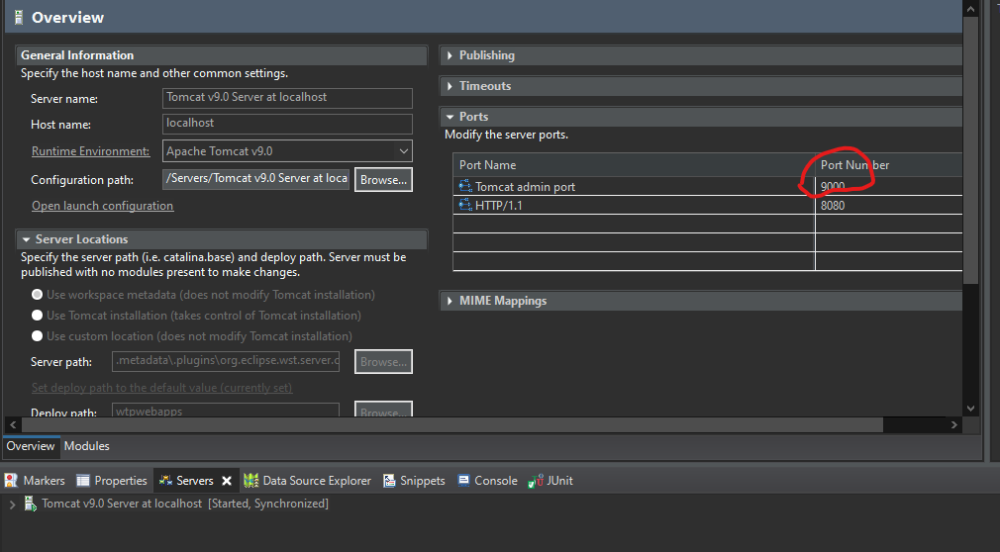

### Prerequisites

1. JDK 11 or up
2. Tomcat https://tomcat.apache.org/download-90.cgi


### Installing
Clone this repo

```
git clone https://github.com/Bshara23/JAVA-RESTful-w-Cryptography.git
```

Add local server

in eclipse go to:
Window > Preferences > Server > Runtime Enviroments > Add...

choose tomcat v9 and define it's location in C drive.

Change tomcat admin port from -1 to 9000

[]()


Test the server
```
run src\com\bshara\cryptoserver\Main\Server.java
```
```
run src\com\bshara\cryptoserver\Tests\ServerTests.java
```
